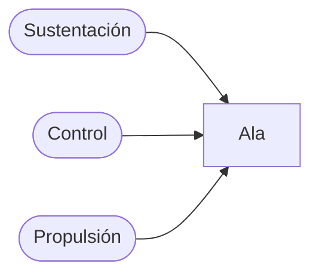
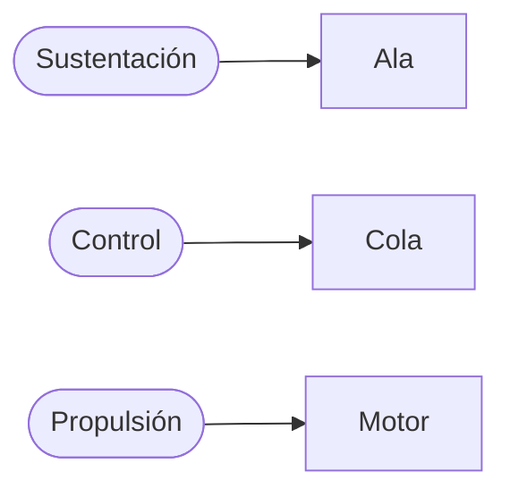
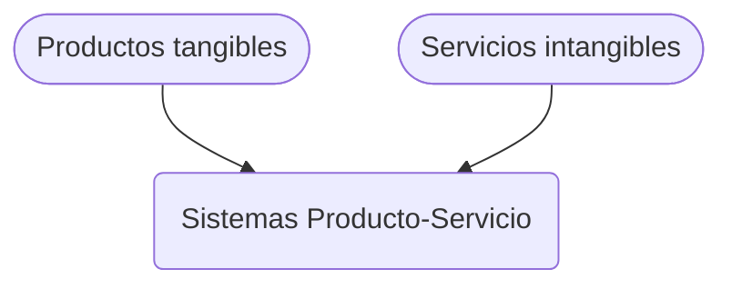

## Introducción al Diseño de Sistemas de Ingeniería

# Arquitecturas de sistemas

Fabián Abarca Calderón

---
layout: quote
---

## No hay viento favorable para quien no sabe adónde va 
*Séneca*

---
layout: intro
---

# Arquitecturas de sistemas

Los **sistemas complejos** requieren una minuciosa **planificación**. Las arquitecturas de sistemas ofrecen **insumos esenciales** para el diseño, la integración, las pruebas y cualquier otra etapa de su desarrollo.

---
layout: section
---

# Introducción

---
layout: image-left
image: https://images.unsplash.com/photo-1689535090647-30d91848abbf
---

## Objetivos

 

***Arquitecturas de sistemas***

- Explorar definiciones
- Reflexionar sobre su importancia
- Estudiar conceptos claves
- Conocer métodos y herramientas de desarrollo
- Discutir tendencias y desafíos

---
layout: section
---

## Arquitecturas de sistemas
# Definiciones

---
layout: two-cols-header
layoutClass: gap-16
---

# Definiciones de arquitectura de sistemas

Primera aproximación: *forma abstracta de la estructura del sistema*.

::left::

> Las arquitecturas de sistemas muestran los **conceptos** o **propiedades** fundamentales del sistema en su **entorno**, expresado en sus **elementos**, **relaciones** y en los principios de su **diseño** y **evolución**.
> 
> --- *(ISO/IEC/IEEE 42010:2011)*

 

  

  - conceptos
  - propiedades
  - entorno
  - elementos
  

  

  - relaciones
  - diseño
  - evolución
  

::right::

> La arquitectura de un sistema es la declaración del **concepto**, la asignación de **función** física o de información a los elementos de **forma**, y la definición de **relaciones** entre los **elementos** y con el **contexto** que los rodea.
>
> --- *Crawley E, Cameron B, Selva D (2016) System architecture: strategy and product development for complex systems. Pearson*

 

  

  - concepto
  - función
  - forma
  

  

  - relaciones
  - elementos
  - contexto
  

---
layout: section
---

## Arquitecturas de sistemas
# Importancia

---
layout: two-cols-header
---

## ¿Por qué, para qué?

::left::

- ¡Hay muchos grados de libertad!
- Las decisiones tempranas tienen un impacto significativo
  - Fijación de parámetros esenciales
  - Definición de categorías
  - Reducción paulatina de las variables

::right::  

- Aclara las alternativas: 
  - Dónde hay que elegir entre tecnologías 
  - Dónde hay que innovar y crear
- Identifica funciones específicas y diferenciadas
  - Revela interacciones entre las partes
- Aumento de la complejidad con disminución del tiempo de diseño

---
layout: two-cols-header
---

## Ejemplo de funciones específicas y diferenciadas

::left::

### Antes (*ornitóptero*)

Concentración de funciones

::right::

### Después (*aeroplano*)

Arquitectura modular

---
layout: section
---

## Arquitecturas de sistemas
# Desarrollo

---

## Marcos estandarizados para arquitecturas de sistemas

La industria, instituciones gubernamentales y organizaciones multinacionales han creado métodos de desarrollo de arquitecturas para simplificar el proceso para las partes involucradas. Esto ha provisto: 

- Lenguaje común
- Procesos definidos
- Acumulación de experiencia

 

---
layout: two-cols-header
---

## Estándares de arquitecturas de sistemas

Existe una gran variedad de estándares de desarrollo de arquitecturas, pero todos ofrecen un núcleo similar.

::left::

### Componentes

- **Metodología**
  - Proceso de diseño
- **Puntos de vista**
  - Definición e intercambio de datos
- **Meta modelo**
  - Modelo de referencia para descripción
- **Glosario**
  - Definición de los términos utilizados

::right::

### Pasos

1. Identificación de las **necesidades** de las partes
2. Definición de alto nivel de los **requisitos**
3. Definición de la **arquitectura funcional**
4. Definición de la **arquitectura física**

Pasos de mayor a menor nivel de abstracción.

---
layout: image
image: https://pubs.opengroup.org/architecture/archimate3-doc/images/fig-Conceptual-Model-of-an-Architecture-Description.png
backgroundSize: contain
---

---
layout: two-cols
---

## ArchiMate

#### *Enterprise Architecture Modeling Language*

 

> La especificación de ArchiMate define un **lenguaje común** para describir la construcción y operación de los procesos de negocio, las estructuras organizacionales, los flujos de información, los sistemas informáticos y la infraestructura técnica.

 

- The Open Group Architecture Framework (TOGAF)
- Está concentrado en la abstracción

::right::

---
layout: two-cols
---

## ARC-IT

#### *Architecture Reference for Cooperative and Intelligent Transportation* 

 

> Arquitectura común para planificar, definir e integrar sistemas inteligentes de transporte. ARC-IT es una arquitectura de referencia: proporciona una base común para que planificadores e ingenieros con diferentes enfoques puedan concebir, diseñar e implementar sistemas utilizando un **lenguaje común**.

 

- Departamento de Transportes, Estados Unidos
- Definición de *paquetes de servicio*
- Establece *flujos de información*

::right::

---
layout: iframe-left
url: https://pubs.opengroup.org/togaf-standard/adm/chap01.html
---

---
layout: section
---

## Arquitecturas de sistemas
# Tendencias

---
layout: two-cols-header
---

## Sistemas de Producto-Servicio

::left::

- Combinación de productos y servicios
- Énfasis en la entrega de servicios 
- Perspectiva social ampliada
- Intervenciones en sistemas existentes

::right::

- Límites del sistema flexibles
- Naturaleza colaborativa (sistema de sistemas)
- Interfaces complejas (servicios, sistemas, personas)
- Uso de modelos de características (*features*)

---
layout: image
image: https://www.researchgate.net/publication/224220942/figure/fig1/AS:669004100292622@1536514415649/A-sample-feature-model.png
backgroundSize: contain
---

---
layout: section
---

# Conclusiones

---
layout: center
---

***Arquitecturas de sistemas***

- Son fundamentales para la definición de sistemas duraderos y sostenibles
- Permiten la identificación, modelado y gestión de interfaces críticas
- Utilizan un conjunto de mejores prácticas, métodos y herramientas para su desarrollo
- Esenciales en un mundo cada vez más complejo

---
layout: end
---

## ¿Cómo crear una arquitectura para un sistema de información en el transporte público inteligente?
