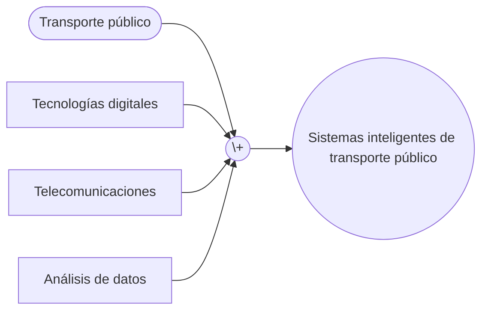

## Introducción al Diseño de Sistemas de Ingeniería

# Sistemas inteligentes de transporte público

Fabián Abarca Calderón

---
layout: image-right
image: https://images.unsplash.com/photo-1727522974667-572d6407d9aa
---

---
layout: section
---

# Introducción

---

## Importancia del transporte público

- Social
- Económico
- Ambiental
- Competitividad

---

## Características de los sistemas de transporte público

- Complejos
- Sistemas sociotécnicos

---

## Sistemas inteligentes de transporte público (SITP)

---

## Sistemas de información

¡No podemos usar un servicio que no conocemos!

---

## Situación actual en Costa Rica

- Limitada información disponible
- Ausencia de una unidad técnica responsable a nivel de diseño
- Atomización administrativa

---
layout: section
---

# Arquitectura del sistema

---

## ARC-IT

---

## GTFS

---

## Otras referencias

---
layout: section
---

# Sistemas de información para personas usuarias

---

## Componentes claves

1. Datos abiertos y estandarizados del servicio
2. Medios *electrónicos* para difusión de información, incluyendo:
   - Página web
   - Aplicaciones móviles (propias y de terceros)
   - Pantallas informativas
3. Medios *impresos* para difusión de información y para promoción, incluyendo:
   - Rotulación (*señalética*)
   - Folletos y vallas informativas
4. Medios de atención al cliente
5. Sistema de identidad visual
6. Campañas de comunicación
7. Tecnologías de telemetría y rastreo de vehículos para información en tiempo real

---
layout: section
---

# Diseño de la arquitectura

---

## Dimensiones del diseño

- Datos
- Aplicaciones
- Tecnología

---

## Fases del diseño

Según ADM

---
layout: section
---

### Plan piloto de la Universidad de Costa Rica

# *b*UCR

---

## Databús

Diagrama tecnológico

---

## Infobús

Diagrama tecnológico

---
layout: section
---

# Trabajo futuro

---

## Propuesta institucional

¡Nuestro trabajo!

---
layout: section
---

# Conclusiones y recomendaciones

---

- El transporte público es complejo