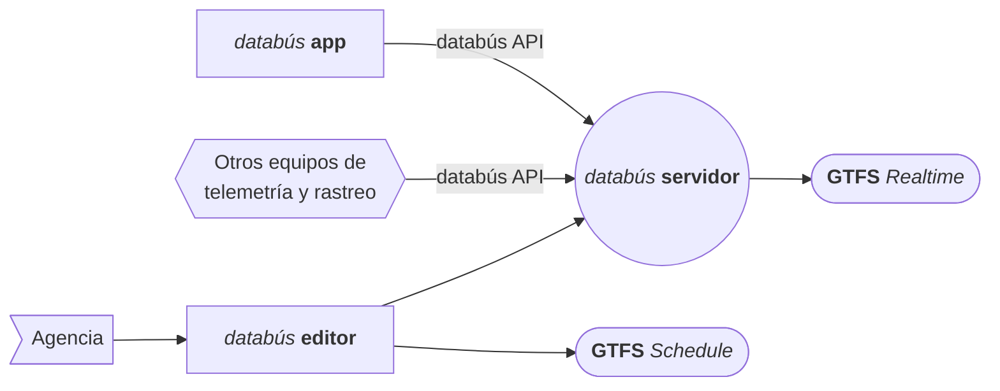
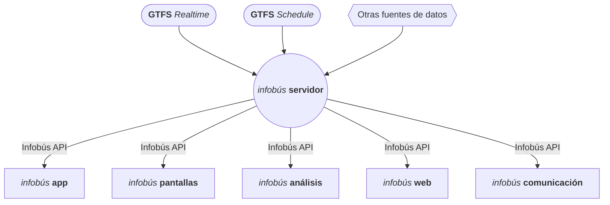

## Introducción al Diseño de Sistemas de Ingeniería

# Sistemas inteligentes de transporte público

Fabián Abarca Calderón

---
layout: section
---

# Introducción

---
layout: two-cols-header
---

## Transporte público

::left::

### Importancia

- **Social**
  - Inclusión
- **Económica**
  - Competitividad
- **Ambiental**
  - Eficiencia

::right::

## Características

- Digitalizado
- Interdisciplinario
- Dinámico
- Complejo
- Sociotécnico
- Gran escala

---
layout: center
---

## Sistemas inteligentes de transporte público (SITP)

Los sistemas inteligentes de transporte público utilizan **tecnologías de información y comunicación** para facilitar la *recolección y uso* de **datos masivos** provenientes de equipos y sensores en **vehículos e infraestructura**.

Como sistema, es una industria de alta tecnología:

- Sensores
- Dispositivos móviles
- Redes de telecomunicaciones 
- Técnicas modernas de procesamiento y análisis de datos
- Otros componentes tecnológicos

---
layout: two-cols-header
---

## Aplicaciones de sistemas inteligentes de *transporte*

::left::

<v-clicks>

- **Operaciones de Vehículos Comerciales**
  - Prioridad de Señales para Carga
  - Cumplimiento Inteligente de Límites de Velocidad

- **Gestión de Datos**
  - Almacén de Datos ITS
  - Monitoreo del Desempeño

- **Mantenimiento y Construcción**
  - Monitoreo de Infraestructura
  - Mantenimiento Invernal

</v-clicks>

::right::

<v-clicks>

- **Gestión de Estacionamientos**
  - Pago Electrónico de Estacionamiento
  - Reservas de Estacionamiento

- **Seguridad Pública**
  - Recuperación de Vehículos Robados
  - Información para Viajeros en Casos de Desastres

- **Transporte Público**
  - Protección de Conexiones de Transporte
  - Solicitud de Parada de Transporte

</v-clicks>

---
layout: two-cols-header
---

## Aplicaciones de sistemas inteligentes de transporte

::left::

<v-clicks>

- **Movilidad Sostenible**
  - Monitoreo de Emisiones
  - Gestión de Zonas de Bajas Emisiones

- **Soporte**
  - Gestión de Seguridad y Credenciales
  - Ubicación y Tiempo

- **Información al Viajero y Movilidad Personal**
  - Señalización dentro del Vehículo
  - Orientación Personalizada

</v-clicks>

::right::

<v-clicks>

- **Gestión del Tráfico**
  - Sistema de Gestión de Incidentes de Tráfico
  - Advertencia y Control de Velocidad

- **Seguridad Vehicular**
  - Advertencia de Velocidad en Curvas
  - Advertencia de Seguridad en Intersecciones y Prevención de Colisiones

- **Clima**
  - Recolección de Datos Meteorológicos
  - Procesamiento y Distribución de Información Climática

</v-clicks>

---
layout: section
---

# Sistemas de información para personas usuarias

---
layout: two-cols-header
---

## Componentes claves

::left::

<v-clicks>

1. Datos abiertos y estandarizados del servicio
2. Medios *electrónicos* para difusión de información, incluyendo:
   - Página web
   - Aplicaciones móviles (propias y de terceros)
   - Pantallas informativas
3. Medios *impresos* para difusión de información y para promoción, incluyendo:
   - Rotulación (*señalética*)
   - Folletos y vallas informativas

</v-clicks>

::right::

<v-clicks>

4. Medios de atención al cliente
5. Sistema de identidad visual
6. Campañas de comunicación
7. Tecnologías de telemetría y rastreo de vehículos para información en tiempo real

</v-clicks>

---
layout: center
---

## Situación actual en Costa Rica

- Limitada información disponible
- Ausencia de una unidad técnica responsable a nivel de diseño
- Atomización administrativa

---

## Objetivos del diseño de un sistema de información

<v-clicks>

- ¿Cómo ser compatibles con **aplicaciones de planificación de viajes intermodales** y otros servicios que consumen y despliegan datos del transporte público en sitios web, aplicaciones o pantallas?
- ¿Cómo crear un sistema de información que no esté **limitado a unos componentes tecnológicos aislados** sino uno que sea parte de una estrategia integral de atención?
- ¿Cómo **maximizar el aprovechamiento** de los datos recopilados, para que sean utilizados también para la operación, gestión, planificación, regulación e investigación?
- ¿Cómo reducir los costos iniciales del sistema, habilitando una **implementación gradual** y ofreciendo alternativas de bajo costo para las etapas iniciales?
- ¿Cómo promover en la implementación del sistema la **participación y competencia de distintos proveedores tecnológicos** para evitar la monopolización innecesaria del servicio?

</v-clicks>

---
layout: section
---

# Diseño de la arquitectura del sistema

---

## Principios de Interoperabilidad de Datos de Movilidad

*Mobility Data Interoperability Principles* ([MDIP](https://www.interoperablemobility.org/))

<v-clicks>

1. Todos los sistemas que *crean*, *modifican* o *consumen* datos de movilidad deben ser **interoperables**.
2. La interoperabilidad debe lograrse mediante el *desarrollo*, *adopción* e *implementación* generalizada de **estándares abiertos** que apoyen el **intercambio** eficiente y la **portabilidad** de los datos de movilidad.
3. Las agencias de transporte y otros proveedores de servicios de movilidad deben tener acceso a *herramientas* que presenten datos de movilidad de alta calidad de manera **accesible**, **equitativa** y **en tiempo real**, para ayudar a los usuarios a satisfacer sus necesidades de movilidad.
4. Las agencias de transporte, otros proveedores de servicios de movilidad y los viajeros deben poder **seleccionar los componentes tecnológicos** de transporte que mejor se adapten a sus necesidades.
5. Todas las personas y el público en general deben estar empoderados, mediante datos de movilidad de alta calidad y bien distribuidos, para encontrar, acceder y utilizar **opciones de movilidad de calidad** que respondan a sus necesidades, manteniendo al mismo tiempo su **privacidad**.

</v-clicks>

---
layout: image-right
image: https://images.unsplash.com/photo-1727522974667-572d6407d9aa
---

## Modelos de información

  

- ¿Cómo le "ponemos nombre" a las cosas?
- ¿Cuáles son los componentes ontológicos del dominio?

---
layout: two-cols-header
---

### GTFS (*General Transit Feed Specification*)

::left::

La especificación del suministro de datos abiertos de transporte público **GTFS** es un estándar *de facto* para la distribución de información del servicio. GTFS tiene dos grandes categorías de datos:

- **GTFS Schedule**   
  Presenta datos de la agencia operadora, las rutas, las paradas, las trayectorias geoespaciales, las tarifas y los horarios... información básica para utilizar el servicio.

- **GTFS Realtime**   
  Actualiza la información de la posición de los vehículos, la estimación de tiempos de llegada a las paradas y las alertas del servicio.

::right::

En particular, GTFS *Realtime* entrega las siguientes *entidades*:

- **`VehiclePositions`**   
  Posición geoespacial del vehículo, nivel de ocupación de pasajeros y el nivel de congestión vial, entre otros.

- **`TripUpdates`**   
  Tiempos estimados de llegada a las paradas para cada viaje y cancelaciones o cambios de ruta.

- **`Alerts`**   
  Afectaciones al servicio, como cambios de paradas, interrupciones de la vía pública, eventos inesperados y otros.

---
layout: two-cols-header
---

### ARC-IT (*Architecture Reference for Cooperative and Intelligent Transportation*)

::left::

La arquitectura de referencia de transporte colaborativo e inteligente del Departamento de Transporte de los Estados Unidos describe:

- perspectivas
- motivaciones
- componentes
- actores
- tecnologías
- interfaces
- otros aspectos 

Es el producto de varias décadas de experiencia de administradores, usuarios, desarrolladores tecnológicos, comunidades y otras partes involucradas en el transporte.

::right::

En su núcleo están los paquetes de servicio (*service packages*): aplicaciones para proveer soluciones a problemas específicos. 

Por ejemplo, en el área de transporte público existen los paquetes de servicio 

- **PT01** Rastreo de Vehículos de Transporte Público
- **PT08** Sistemas de Información de Pasajeros

---
layout: two-cols
---

### Smart Data Models

Sistematiza la *información de contexto* en varias áreas de relevancia industrial, comercial y académica, como ciudades inteligentes, agricultura de precisión y otros.

Smart Data Models utiliza **NGSI-LD** (*Next Generation Service Interfaces*), un estándar del Instituto Europeo de Normas de Telecomunicaciones (ETSI) para proveer datos estructurados de contexto, que define entidades, relaciones y propiedades dentro de un área del conocimiento.

> Las definiciones en SDM están basadas en otros estándares comunes, incluyendo el mismo GTFS, por lo que constituye una valiosa fuente de estructuración de la información.

::right::

### Protocolo Común de Alerta

Opción recomendada para la especificación de los datos suministrados en sistemas de alertas. 

Es creado y promovido por la Oficina de las Naciones Unidas para la Reducción del Riesgo de Desastres (UNDRR), avalado por la Unión Internacional de Telecomunicaciones (UIT) y utilizado por la Cruz Roja y otras organizaciones.

---
layout: image-right
image: https://images.unsplash.com/photo-1727522974667-572d6407d9aa
---

## Modelos de comunicación entre servicios

  

- ¿Cuál es el canal físico de comunicación?
- ¿Quién inicia la comunicación?
- ¿Cuál es la capacidad de transmisión de datos?

---
layout: two-cols
---

### Orientada a eventos (*event-driven*) 

En la arquitectura orientada a eventos (EDA, *Event-driven Architecture*) la generación de un *evento* puede desencadenar la *invocación* de uno o más servicios desacoplados.

::right::

### Publicación/suscripción (*pub/sub*) 

Un *publicador* genera *mensajes* sobre eventos para ser propagados a suscriptores que reciben la información por medio de canales dedicados a *tópicos* específicos. MQTT (*Message Queuing Telemetry Transport*) es un ejemplo popular para sistemas en tiempo real.

---
layout: two-cols
---

### Solicitud/respuesta (*request/response*) 

Un cliente hace una solicitud a un servidor, el cual envía de vuelta una respuesta.

::right::

### Web API 

(Caso especial de solicitud/respuesta)

Un servidor expone unas terminales (*endpoints*) donde un cliente puede interactuar de forma programática con los recursos disponibles.

- Operaciones CRUD (crear, leer, actualizar, borrar)
- Solicitar datos especiales

---
layout: image-right
image: https://images.unsplash.com/photo-1727522974667-572d6407d9aa
---

## Modelos de gestión de datos

  

- ¿Dónde almacenamos los datos?
- ¿Cómo procesamos los datos?

---

- **Lago de datos** (*data lake*):  
  Almacena *datos desestructurados o semi estructurados* de fuentes distintas, posiblemente con formatos heterogéneos, que son mantenidos en su formato original. Los datos no tienen un valor conocido para el sistema y siguen el concepto de “cargar los datos ahora y analizarlos luego”.

- **Almacén de datos** (*data warehouse*):  
  Administra *información estructurada* que facilita los procesos analíticos. En estos, la información ha sido extraída, cargada y transformada (ELT) de manera que es posible hacer consultas y análisis eficientes para tomar decisiones informadas.

- **Concentrador de datos** (*data hub*):  
  Gestiona *datos heterogéneos pero estructurados y armonizados* y está optimizado para su integración con tecnologías de ciencia e ingeniería de datos. Actúa como un repositorio central para datos recopilados y datos generados, típicamente con posibilidades de visualización.

---
layout: section
---

# Principios del diseño

---

## Principios Empresariales

### Maximizar los Beneficios para las Personas Usuarias

Un servicio público debe priorizar la mejora continua de la experiencia de sus personas usuarias.

### Sostenibilidad Financiera y Asequibilidad del Servicio

La implementación de nuevas tecnologías debe asegurar una financiación adecuada que minimice los riesgos financieros para las empresas privadas, como proveedoras del servicio, y que al mismo tiempo mantenga costos razonables para las personas usuarias.

- Sin un modelo de negocio sostenible, el esquema de concesión del transporte público en Costa Rica no puede sostenerse.
- El diseño del sistema debe planificarse cuidadosamente para permitir una implementación gradual y con bajos costos iniciales. 
- Podría discutirse nueva legislación para hacer cambios estructurales relacionados, por ejemplo, con los mecanismos de financiamiento de las nuevas tecnologías. 
- También deben considerarse los subsidios, como lo han sugerido varias entidades técnicas.

---

## Principios de Datos

### Los Datos del Servicio son Abiertos y Estandarizados

Todos los datos relacionados con el servicio que deben estar disponibles para las personas usuarias con el fin de facilitar el uso del sistema deben ser abiertos y fácilmente accesibles para el público.

- Existe una obligación por parte de los proveedores de un servicio público de ser claros y transparentes con toda la información que sus personas usuarias necesitan.
- Las entidades rectoras crearán los canales adecuados para compartir los datos abiertos.

### Los Datos Operativos se Comparten

Los datos operativos son un recurso valioso para múltiples actores del sistema y deben estar accesibles para fomentar la eficiencia, la regulación y la mejora continua.

### Vocabulario Común y Definiciones de Datos

Todos los componentes tecnológicos del sistema seguirán un conjunto único de conceptos y definiciones.

---

## Principios de Aplicación

### Unicidad de la Información

La información disponible para la persona usuaria debe ser consistente, precisa y provenir de una única fuente.

- Información del sistema de transporte público en su totalidad.

### Facilidad de Uso y Accesibilidad

El servicio debe estar diseñado para todas las personas usuarias.

- Sensibilidad a las necesidades de personas con distintas habilidades físicas, cognitivas o niveles de conocimiento previo.

---
layout: two-cols-header
---

## Principios Tecnológicos

::left::

### Arquitectura Única del Sistema

Todas las partes interesadas deben seguir y cumplir con las directrices de una arquitectura de sistema única definida por los entes rectores.

- Un sistema complejo requiere un plan bien definido para evolucionar de manera fluida.
- Los entes rectores deben actuar como planificadores tecnológicos, propietarios del producto y árbitros, y deben desarrollar la capacidad técnica necesaria para asumir estos roles.

::right::

### Independencia Tecnológica

Las implementaciones deben ser independientes de elecciones tecnológicas particulares, permitiendo su funcionamiento en múltiples plataformas y en conjunto con sistemas externos.

### Interoperabilidad

Las implementaciones deben seguir estándares establecidos para asegurar compatibilidad e intercambio efectivo de información entre sistemas.

- Reduce costos al aprovechar infraestructura existente y fomenta la innovación mediante la colaboración. 
- Modelo de gobernanza para desarrollar, adoptar y revisar estándares relevantes.

---
layout: image-left
image: https://fabianabarca.github.io/senaletica/assets/logos/b_azul_fondo_blanco.png
backgroundSize: contain
---

### Plan piloto de la Universidad de Costa Rica

  

# *b*UCR

---

## Databús

> Recolección de datos de telemetría y rastreo de vehículos y eventos del transporte público

---

## Infobús

> Distribución de datos en tiempo real para servicios de información de transporte público

---
layout: center
---

# Trabajo futuro

- Propuesta institucional: ¡Nuestro trabajo!

---
layout: end
---

Gracias