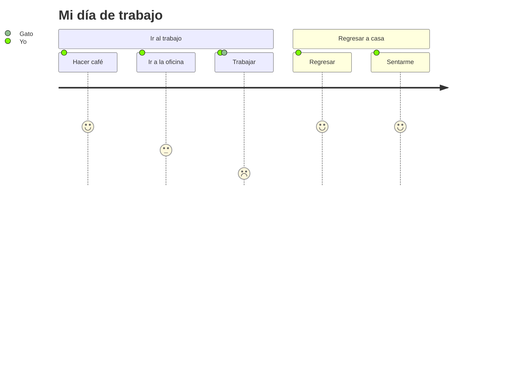

## Introducción al Diseño de Sistemas de Ingeniería

# Digitalización de la sociedad

José Fabián Morales Quesada

---
layout: image-right
image: https://images.unsplash.com/photo-1727522974667-572d6407d9aa
---

**Agenda**

 

<Toc text-sm minDepth="1" maxDepth="2" />

---

# Introducción

---
layout: two-cols
layoutClass: gap-16
---

## Concepto básico
## Digitalización
Es un megatendencia del siglo veintiuno

Lorem ipsum dolor sit amet, consectetur adipiscing elit. Vestibulum non ornare ligula, nec posuere sem. Nam consequat ornare leo, ac consectetur tellus dapibus nec. Nulla facilisi.

---
## Etapas de cadena de opcion empresariales

1.Pronóstico
2.Estrategias
3.Procesos
4.Sistemas de TI

---
## Digitisation
Se refiere concepto de pasar algo físico a lo digital.

###Ejemplo
Escaner un documento.
::right::

## Digitalisation
Se entiende una digitalizacion de procesos, tomando encuenta no solo el uso de tecnología si no que tambien aspectos tecnicos y sociales porcesos productos o servicios.

### Ejemplo
Automatización de pedidos de inventario.

::right::

## Otro concepto
## Digital transformation
Implica cambio para adatar los sistemas de una organizacion a lo digital, incluyendo estructuracion, procesos o mentalidad.

### Ejemplo
Un ecosistema digital de una tienda.

---
# Campos de digiatlización

1. Digitalización de Productos y Servicios

2. Digitalización de la creación de valor

3. Digitalización de modelos de negocio

---
## Digitalización de Productos y Servicios

La digitalización de productos y servicios se refiere a las innovaciones en productos basadas en tecnologías digitales y a las innovaciones en servicios realizadas mediante el uso de tecnologías digitales.

Nullam consectetur egestas sapien quis pulvinar. Aliquam sagittis mi eget ante condimentum, quis consectetur arcu posuere. Morbi venenatis tempus consectetur. Nam ac placerat enim.
### Ditilizacion de sectores
En mercado con Amazon, entretenimiento con Netflix, hospedaje con Airbnb.

### Vórtice digital
Bradley et al. utilizan esta metáfora para describir la convergencia inevitable de todas las industrias hacia un centro digital donde las ofertas se digitalizan al máximo.

### Evolución de productos físicos a sistemas de sistemas
La creciente incorporación de tecnologías digitales y su interconexión ha transformado productos clásicos, como la maquinaria agrícola, en los llamados "sistemas de sistemas".

### La relevancia de la ley de Zuboff
Todo lo que puede ser digitalizado será digitalizado.

### Ejemplos de productos digitalizados
1. El proveedor de ropa de tenis Babolat integró sensores y componentes de red en el agarre de sus raquetas de tenis
2. Los neumáticos inteligentes de Hankook con la capacidad de frenar automáticamente en caso de hielo
3. El fabricante de moda Ralph Lauren lanzó al mercado una camiseta deportiva inteligente.

### Productos físicos y digitales
Muchos de pruductos que presentan componentes de ambos tipos, tanto físicos como digitales, son llamdos productos digitalizados y se consideran en muchos casos sitemas de ingeieria por su complejidad, muchas de las innovaciones que se trabjan actualmente se enfocan en este tipo de productos.

### Digitalización en la medicina
Este es un area que por medio de la digitalizacion busca el aumento de la calidad del tratamiento, la reducción de complicaciones y la disminución de las estancias hospitalarias, con la mejora en la generación y la evaluación de los datos médicos, sistemas robóticos como asistencia para las operaciones, etc.

---
## Digitalización de la creación de valor
Una digitalizacion que permite tener productos individuales de manera rentable, aumentar la eficiencia de los recursos, acortar los tiempos de procesamiento e identificar y controlar factores disruptivos en una etapa temprana. 

### Digitalización Horizontal de la Cadena de Valor
Este aspecto se centra en la integración y optimización del flujo de información y bienes entre proveedores, socios de cooperación, clientes y la propia empresa.

1. En el centro de esta digitalización horizontal se encuentra la conexión en red de los recursos autónomos de producción y transporte.
2. Faciliza la cooperacion entre socios.
3. La comunicación máquina a máquina.
4. Las máquinas, robots, transportadores y sistemas de almacenamiento negocian entre sí y entre empresas.
5. Esta creación de valor optimizada en tiempo real genera demandas de mercado.

::right::

### Digitalización Vertical de la Cadena de Valor
Este tipo de digitalización asegura un flujo continuo de información y datos desde las ventas hasta el desarrollo de productos, la producción y la logística.

1. Mejor monitoreo del todos los procesos.
2. Flexibilidad y adaptabilidad ante necesidades del mercado.
3. Regulacion autamatica en procesos administrativos de gestión de inventario y contabilidad.
4. Mejor gestion ante eventos no planificados.

---
## Digitalización de modelos de negocio
La digitalización en esta area es enorme al no solo imcluir las productos y servicios, si no que transforma la estructura de todo un negocio.

### Plataformas digitales
Una plataforma digital es un mercado que conecta a proveedores y consumidores, así como a otros actores, a través de Internet, permitiendo interacciones de valor añadido entre ellos.

### Servicios inteligentes
Los servicios inteligentes son servicios digitales que generan valor añadido al evaluar datos de sistemas técnicos inteligentes y conectados en red, y se proporcionan a través de plataformas digitales. Se basan en sistemas ciberfísicos o productos inteligentes y forman un sistema integrado producto-servicio.

###Ecosistemas digitales
Un ecosistema digital es un sistema completo de productos inteligentes y servicios digitales basados en ellos, conectados en red a través de plataformas digitales.

---
# La movilidad como ejemplo de la digitalización de la sociedad

---

#Desafíos y Oportunidades Sociales de la Digitalización
---
theme: default
title: Digitalización de la sociedad
info: Introducción al Diseño de Sistemas de Ingeniería
class: text-center
transition: fade-out
background: https://images.unsplash.com/photo-1637190623651-e6b10007a0b7
---

## Introducción al Diseño de Sistemas de Ingeniería

# Digitalización de la sociedad

José Fabián Morales Quesada

---
layout: image-right
image: https://images.unsplash.com/photo-1727522974667-572d6407d9aa
---

**Agenda**

 

<Toc text-sm minDepth="1" maxDepth="2" />

---

# Introducción

---
layout: two-cols
layoutClass: gap-16
---

## Concepto básico
## Digitalización
Es un megatendencia del siglo veintiuno

Lorem ipsum dolor sit amet, consectetur adipiscing elit. Vestibulum non ornare ligula, nec posuere sem. Nam consequat ornare leo, ac consectetur tellus dapibus nec. Nulla facilisi.

---
## Etapas de cadena de opcion empresariales

1.Pronóstico
2.Estrategias
3.Procesos
4.Sistemas de TI

---
## Digitisation
Se refiere concepto de pasar algo físico a lo digital.

###Ejemplo
Escaner un documento.
::right::

## Digitalisation
Se entiende una digitalizacion de procesos, tomando encuenta no solo el uso de tecnología si no que tambien aspectos tecnicos y sociales porcesos productos o servicios.

### Ejemplo
Automatización de pedidos de inventario.

::right::

## Otro concepto
## Digital transformation
Implica cambio para adatar los sistemas de una organizacion a lo digital, incluyendo estructuracion, procesos o mentalidad.

### Ejemplo
Un ecosistema digital de una tienda.

---
# Campos de digiatlización

1. Digitalización de Productos y Servicios

2. Digitalización de la creación de valor

3. Digitalización de modelos de negocio

---
## Digitalización de Productos y Servicios

La digitalización de productos y servicios se refiere a las innovaciones en productos basadas en tecnologías digitales y a las innovaciones en servicios realizadas mediante el uso de tecnologías digitales.

Nullam consectetur egestas sapien quis pulvinar. Aliquam sagittis mi eget ante condimentum, quis consectetur arcu posuere. Morbi venenatis tempus consectetur. Nam ac placerat enim.
### Ditilizacion de sectores
En mercado con Amazon, entretenimiento con Netflix, hospedaje con Airbnb.

### Vórtice digital
Bradley et al. utilizan esta metáfora para describir la convergencia inevitable de todas las industrias hacia un centro digital donde las ofertas se digitalizan al máximo.

### Evolución de productos físicos a sistemas de sistemas
La creciente incorporación de tecnologías digitales y su interconexión ha transformado productos clásicos, como la maquinaria agrícola, en los llamados "sistemas de sistemas".

### La relevancia de la ley de Zuboff
Todo lo que puede ser digitalizado será digitalizado.

### Ejemplos de productos digitalizados
1. El proveedor de ropa de tenis Babolat integró sensores y componentes de red en el agarre de sus raquetas de tenis
2. Los neumáticos inteligentes de Hankook con la capacidad de frenar automáticamente en caso de hielo
3. El fabricante de moda Ralph Lauren lanzó al mercado una camiseta deportiva inteligente.

### Productos físicos y digitales
Muchos de pruductos que presentan componentes de ambos tipos, tanto físicos como digitales, son llamdos productos digitalizados y se consideran en muchos casos sitemas de ingeieria por su complejidad, muchas de las innovaciones que se trabjan actualmente se enfocan en este tipo de productos.

### Digitalización en la medicina
Este es un area que por medio de la digitalizacion busca el aumento de la calidad del tratamiento, la reducción de complicaciones y la disminución de las estancias hospitalarias, con la mejora en la generación y la evaluación de los datos médicos, sistemas robóticos como asistencia para las operaciones, etc.

---
## Digitalización de la creación de valor
Una digitalizacion que permite tener productos individuales de manera rentable, aumentar la eficiencia de los recursos, acortar los tiempos de procesamiento e identificar y controlar factores disruptivos en una etapa temprana. 

### Digitalización Horizontal de la Cadena de Valor
Este aspecto se centra en la integración y optimización del flujo de información y bienes entre proveedores, socios de cooperación, clientes y la propia empresa.

1. En el centro de esta digitalización horizontal se encuentra la conexión en red de los recursos autónomos de producción y transporte.
2. Faciliza la cooperacion entre socios.
3. La comunicación máquina a máquina.
4. Las máquinas, robots, transportadores y sistemas de almacenamiento negocian entre sí y entre empresas.
5. Esta creación de valor optimizada en tiempo real genera demandas de mercado.

::right::

### Digitalización Vertical de la Cadena de Valor
Este tipo de digitalización asegura un flujo continuo de información y datos desde las ventas hasta el desarrollo de productos, la producción y la logística.

1. Mejor monitoreo del todos los procesos.
2. Flexibilidad y adaptabilidad ante necesidades del mercado.
3. Regulacion autamatica en procesos administrativos de gestión de inventario y contabilidad.
4. Mejor gestion ante eventos no planificados.

---
## Digitalización de modelos de negocio
La digitalización en esta area es enorme al no solo imcluir las productos y servicios, si no que transforma la estructura de todo un negocio.

### Plataformas digitales
Una plataforma digital es un mercado que conecta a proveedores y consumidores, así como a otros actores, a través de Internet, permitiendo interacciones de valor añadido entre ellos.

### Servicios inteligentes
Los servicios inteligentes son servicios digitales que generan valor añadido al evaluar datos de sistemas técnicos inteligentes y conectados en red, y se proporcionan a través de plataformas digitales. Se basan en sistemas ciberfísicos o productos inteligentes y forman un sistema integrado producto-servicio.

###Ecosistemas digitales
Un ecosistema digital es un sistema completo de productos inteligentes y servicios digitales basados en ellos, conectados en red a través de plataformas digitales.

---
# La movilidad como ejemplo de la digitalización de la sociedad

---

#Desafíos y Oportunidades Sociales de la Digitalización

---

# Aplicaciones

---

# Casos de estudio

$$
x_{1,2} = \frac{-b \pm \sqrt{b^2 - 4ac}}{2a}
$$

---

# Retos y tendencias

---

# Conclusiones

1. Esta es una lista
2. de conclusiones o síntesis sobre
3. la teoría presentada en las diapositivas

---
