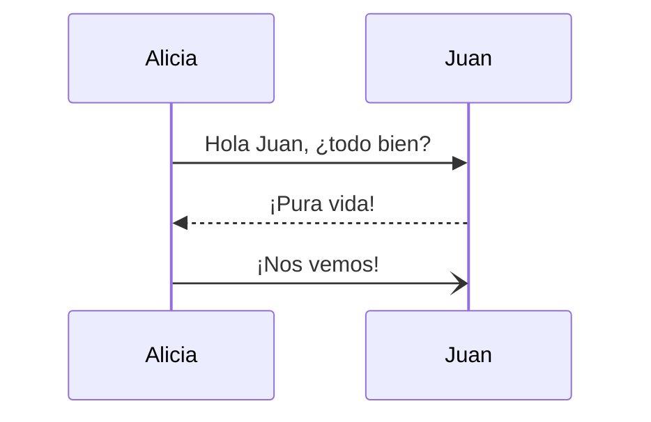
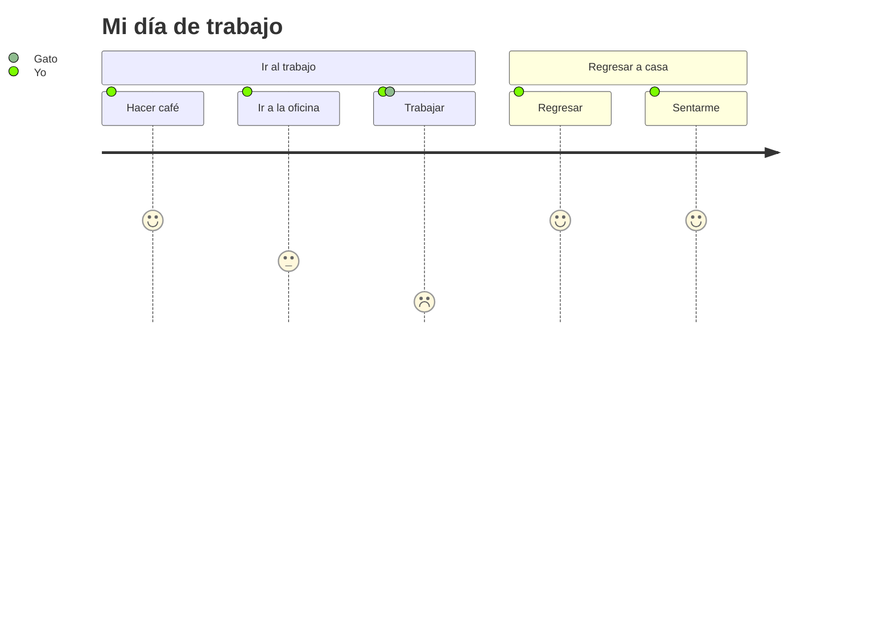

## Introducción al Diseño de Sistemas de Ingeniería

# Complejidad técnica y social

Gabriel Antonio Cambronero Hernández

---
layout: image-right
image: https://images.unsplash.com/photo-1727522974667-572d6407d9aa
---

**Agenda**

 

<Toc text-sm minDepth="1" maxDepth="2" />

---

# Introducción

---
layout: two-cols
layoutClass: gap-16
---

## Concepto básico

Lorem ipsum dolor sit amet, consectetur adipiscing elit. Vestibulum non ornare ligula, nec posuere sem. Nam consequat ornare leo, ac consectetur tellus dapibus nec. Nulla facilisi.

::right::

## Otro concepto

Nullam consectetur egestas sapien quis pulvinar. Aliquam sagittis mi eget ante condimentum, quis consectetur arcu posuere. Morbi venenatis tempus consectetur. Nam ac placerat enim.

---

# Aplicaciones

---

# Casos de estudio

$$
x_{1,2} = \frac{-b \pm \sqrt{b^2 - 4ac}}{2a}
$$

---

# Retos y tendencias

---

# Conclusiones

1. Esta es una lista
2. de conclusiones o síntesis sobre
3. la teoría presentada en las diapositivas

---