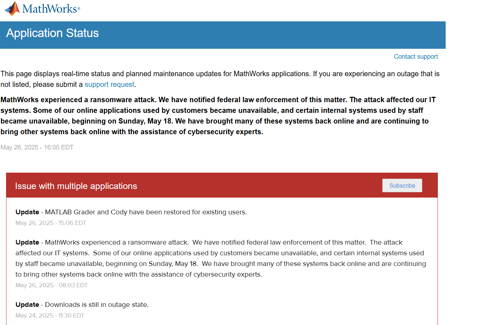
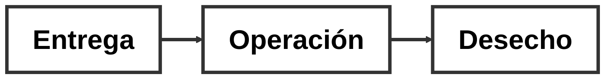

## Introducción al Diseño de Sistemas de Ingeniería

# Propiedades de los sistemas de ingeniería

Denzel Darío Guzmán Carranza

---
layout: image-right
image: https://images.unsplash.com/photo-1727522974667-572d6407d9aa
---

**Agenda**

 

<Toc text-sm minDepth="1" maxDepth="2" />

---

# Introducción

Algunos cuestionamientos

¿Qué es una propiedad en un sistema de ingeniería?

¿Qué propiedades deseamos en un sistema?

¿Por qué orientamos nuestros sistemas a ciertas propiedades?

---
layout: two-cols
layoutClass: gap-16
---

## ¿Qué es una propiedad?

Se define como un atributo, cualidad o característica de alguna cosa en específico -- (Definición general)

## En un sistema de ingeniería

i) Calidad

ii) Seguridad

iii) Usabilidad

iv) Mantenibilidad

Son consideradas como parte fundamental en el "surgimiento deseable de un sistema"

::right::

## Propiedades deseadas

Entonces se pueden definir a las propiedades de un sistema de ingeniería como bloques que sostienen una estructura. Pero cuidado, las propiedades NO son requerimientos de funcionamiento del sistema.

---

# Algunas propiedades de sistemas de ingeniería

| Propiedad         | Descripción breve                                                   |
|-------------------|----------------------------------------------------------------------|
| Comprensibilidad  | Facilidad con la que se entiende el sistema                         |
| Durabilidad       | Capacidad del sistema para operar por largos períodos sin fallas    |
| Accesibilidad     | Facilidad de acceso para los usuarios previstos                      |
| Tiempo de respuesta | Rapidez con la que el sistema reacciona a entradas               |
| Seguridad         | Protección contra accesos no autorizados y fallas                   |
| Mantenibilidad    | Facilidad para realizar mantenimiento y actualizaciones             |

  ¡Y hay MUCHAS más!

---

# Propiedades como respuesta a dificultades

# ¡Aprovechemos para odiar a matlab como un sistema que careció de algunas propiedades!
---

---

## Ciclo de vida

---

## Complejidad
- Los sistemas suelen ser complejos y estar ramificados en muchas partes que interactúan entre sí

Se pueden describir cinco aspectos de un sistema que lo hacen complejo

1. Complejidad estructural

2. Comportamiento

3. Contextual

4. perceptual

5. Temporal

# Concepto: Modularidad

Esta es una propiedad que divide la complejidad en ramas más pequeñas y menos complejas de manejar

---
layout: two-cols
layoutClass: gap-16
---

## Comportamiento humano
Es importante considerar que, los sistemas de ingeniería dependen directamente de la acción humana para mantenimiento, desarrollo y operación.

La experiencia del sistema puede ser subjetiva y puede afectar a la experiencia del usuario.

Ejemplo: *Un tren muy estético y su impacto*

- La confianza es una propiedad importante y depende de factores culturales y de contexto

::right::

## ❓ Incertidumbre

Pueden haber afectaciones inesperadas que comprometan el desempeño de un sistema

- Robustez
- Flexibilidad

  

---

# 🌐 Propiedades de Cambio en Sistemas: Enfoque Semántico

## ❓ Problema con términos como *flexibilidad*, *adaptabilidad*, *robustez*

- ⚠️ Generan ambigüedad:
  - **Sinonimia**: varios términos con significados similares.
  - **Polisemia**: un término con múltiples significados relacionados.
- 🧩 Dificultan la comunicación clara de requisitos no funcionales.

## ✅ Solución: Base Semántica (Ross & Rhodes, 2015)

> 💡 En lugar de usar etiquetas, describimos lo que se desea que haga el sistema frente al cambio.

**Estructura base**:

🧠 *"Ante una perturbación en cierto contexto, se desea que un agente realice un cambio en el sistema que produzca un resultado valioso."*

---

## 🧪 Ejemplos usando la base semántica

|  Escenario |  Agente |  Cambio |  Resultado |  Propiedad |
|-------------|-----------|-----------|---------------|----------------|
| Externo al sistema | Sí | Diferente | Valioso | **Flexibilidad** |
| Interno al sistema | Sí | Diferente | Valioso | **Adaptabilidad** |
| Cualquiera | No | Igual | Valioso | **Robustez** |
## 🌟 Ventajas del Enfoque Semántico

- ❌ Evita confusión en etiquetas.
- ✅ Permite describir propiedades aún sin nombre.
- ✅ Facilita requisitos claros, medibles y repetibles.

> 💡Ejemplo: Ancho de banda flexible y escalable en respuesta a un aumento en la demanda de los usuarios sin pasarse de un costo mínimo en un tiempo mínimo

---

## Trade-offs en las propiedades de un sistema
> Un trade-off es una compensación, para ganar un beneficio se debe sacrificar algo. 

Cuando diseñamos sistemas de ingeniería, a menudo queremos que tengan múltiples propiedades deseables, como flexibilidad y robustez, pero ¿es posible lograr ambas sin compromisos? ❓❓❓

>Para lograr el mejor diseño, debemos analizar cada propiedad en contexto y considerar cómo afectan la funcionalidad y el costo del sistema. ¡La clave está en encontrar el equilibrio adecuado!

Para analizar estos trade-offs (compromisos), hay varios métodos:

> 1) SAI (Systems of Systems Architecting for ilities) – Un proceso de ocho pasos que ayuda a elegir la mejor arquitectura teniendo en cuenta incertidumbres y opciones de diseño que afectan las propiedades del sistema.
> 2) iQFD (Ilities en Quality Function Deployment) – Un método basado en entrevistas con stakeholders para entender cuáles son las propiedades clave que deben incluirse desde el inicio del diseño.
> 3) KAOS + Simulación – Dado que cada stakeholder tiene intereses distintos, se pueden generar conflictos. Se utiliza para ayudar a los interesados a identificar los criterios de evaluación adecuados a partir de las "ilities" deseadas (como fiabilidad o mantenibilidad).

Cada método intenta evaluar cómo se pueden mejorar estas propiedades sin tratarlas de forma aislada. Además, es crucial entender que algunos atributos pueden entrar en conflicto según cómo se implementen. Por ejemplo, flexibilidad y robustez.
---

## Diseño para las propiedades previstas
Necesidades vs. Motivaciones:
> - Determinar si las propiedades deseadas surgen de necesidades directas o motivaciones ambiguas.

>- Importancia de basar el diseño en desafíos reales y anticipados.
## Anticipación de Incertidumbres:
Por ejemplo, si se prevé que el sistema tendrá que adaptarse a cambios regulatorios (como normas más estrictas de emisiones), se puede optar por una plataforma vehicular flexible que facilite la modificación o actualización de componentes críticos.
>Caso de la plataforma MQB de Volkswagen.
- Modularidad: Permite que el mismo "esqueleto" básico se adapte a diferentes tamaños, tipos de carrocería y configuraciones de motor. 
- Cuando se hacen efectivos requisitos más estrictos, los modelos sobre esta plataforma pueden ajustarse sin tener que rediseñar por completo la estructura del vehículo.
---

> El diagrama destaca un ciclo integral donde el diseño inicial (basado en patrones y principios) se articula con la identificación y gestión de incertidumbres y perturbaciones. Se subraya la importancia de anticipar cambios y preparar mecanismos de respuesta, de modo que el sistema pueda adaptarse y mantener un desempeño óptimo en entornos cambiantes. Este enfoque es crucial para lograr diseños resilientes que respondan efectivamente a desafíos emergentes

Ejemplo concreto del flujo del diagrama aplicado a un sistema de transporte

- Imaginese que una ciudad quiere renovar su flota de autobuses urbanos para que, en el futuro, se adapten fácilmente a cambios en la normativa ambiental y a avances tecnológicos.
---

# Respuesta a necesidades emergentes

>Capacidad de un sistema para adaptarse a cambios o incertidumbres imprevistas que pueden surgir en el futuro. 🕒

> La idea es que, al incorporar desde un primer momento propiedades deseables como flexibilidad, extensibilidad, interoperabilidad, robustez y versatilidad el sistema estará mejor preparado para enfrentar incertidumbres futuras.
### Ejemplo: 
Algunos sistemas de defensa de Estados Unidos que exhiben propiedades relacionadas con las "iledades" tienden a tener una vida útil extendida a diferencia de aquellos que no los tienen. Es decir que duran más de lo que se tenía previsto

### Perspectiva CAS (*Complex Adaptative System*)
> los sistemas no se diseñan completamente desde el inicio, sino que una parte se diseña y otra parte emerge con el tiempo. Lo importante en esta visión es cómo el sistema y su entorno interactúan y evolucionan juntos. En lugar de controlar todo directamente, se influye en el sistema mediante información e incentivos, permitiendo que se autoorganice
- No todo se puede prever. Es mejor que el sistema se adapte y evolucione por si solo

Así, el sistema puede ser flexible y ágil, es decir, capaz de cambiar y reaccionar rápidamente cuando surgen nuevas situaciones.
---

# Principios de diseño de la capacidad de evolución

Los principios de diseño para la evolutividad ayudan a hacer intervenciones que permitan que un sistema de ingeniería evolucione con el tiempo. La evolutividad implica cambios fundamentales en el propósito del sistema, como si se modificara su "ADN". Esto requiere acciones deliberadas, llamadas intervenciones de diseño.

- Una intervención de diseño es cuando tú, como diseñador o ingeniero, haces un cambio consciente en un sistema para influir en cómo funcionará o evolucionará en el futuro.

> *Ejemplo* : Diseñar un vehículo con espacio para agregar nuevas tecnologías (como sensores o baterías más grandes).

Una intervención de diseño no es solo resolver un problema actual, sino preparar al sistema para cambiar, adaptarse o crecer más adelante
---
layout: center
---

# CONCLUSIONES
